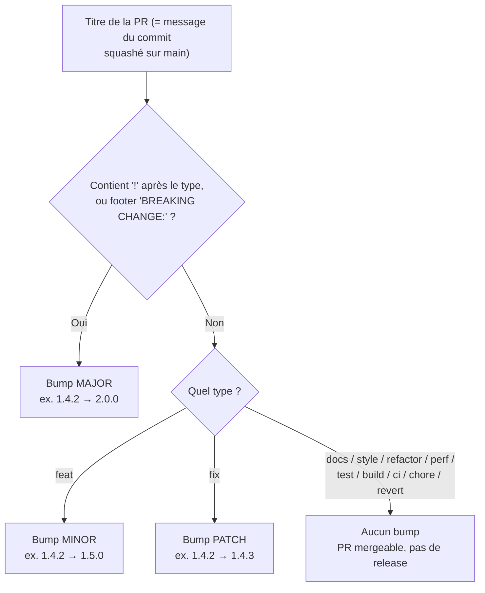
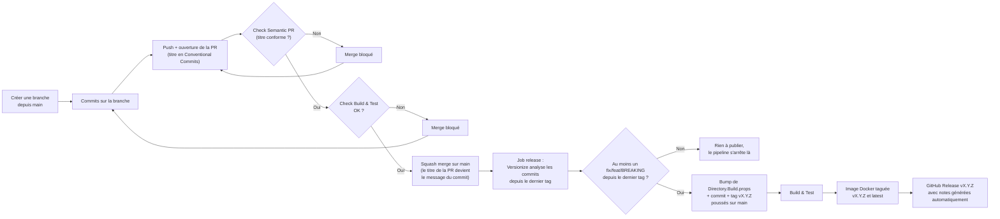

# Versioning : SemVer & Conventional Commits

Ce document explique comment la version du projet est calculée automatiquement, et comment l'influencer via le titre de vos Pull Requests. Pour le détail des choix d'implémentation (outillage, apps GitHub, réglages du repo), voir [ADR 0008](adr/0008-versioning-semver-conventional-commits.md).

## SemVer en une phrase

Un numéro de version `MAJOR.MINOR.PATCH` (ex. `1.4.2`) où chaque partie a un sens précis ([semver.org](https://semver.org/lang/fr/)) :

| Partie | Incrémentée quand... | Exemple |
|---|---|---|
| **MAJOR** | un changement casse la compatibilité (comportement existant modifié/supprimé) | `1.4.2` → `2.0.0` |
| **MINOR** | une fonctionnalité est ajoutée, de façon rétrocompatible | `1.4.2` → `1.5.0` |
| **PATCH** | un bug est corrigé, sans changer le comportement attendu | `1.4.2` → `1.4.3` |

## Conventional Commits en une phrase

Un format standardisé de message ([conventionalcommits.org](https://www.conventionalcommits.org/fr/v1.0.0/)) qui rend le type de changement lisible par une machine :

```
<type>[(scope optionnel)][!]: <description>

[corps optionnel]

[footer(s) optionnel(s), ex. BREAKING CHANGE: ...]
```

Dans ce repo, c'est le **titre de la Pull Request** qui doit suivre ce format (validé par le check `Semantic PR`, voir ADR 0008) — pas nécessairement chaque commit de la branche.

Exemples valides :
- `feat: ajoute le digest hebdomadaire`
- `fix(worker): corrige le parsing de la date de création`
- `feat!: renomme Worker__PollingCronExpression en Worker__Cron`
- `chore: met à jour les dépendances NuGet`

## Tous les types possibles et leur effet sur la version

Seuls `feat`, `fix` et un changement incompatible (`!` ou footer `BREAKING CHANGE:`) ont une signification définie par la spécification Conventional Commits en matière de version. Les autres types sont reconnus par convention (issue d'Angular) mais **ne déclenchent jamais de release** ici — c'est exactement le comportement de [Versionize](https://github.com/versionize/versionize), l'outil utilisé par ce repo.

| Type | Usage typique | Déclenche une release ? | Résultat |
|---|---|---|---|
| `feat` | nouvelle fonctionnalité | ✅ | **MINOR** |
| `fix` | correction de bug | ✅ | **PATCH** |
| `!` après le type, ou footer `BREAKING CHANGE:` | changement incompatible (combinable avec `feat`/`fix`/autre) | ✅ | **MAJOR** (prime sur MINOR/PATCH) |
| `docs` | documentation uniquement | ❌ | aucun |
| `style` | formatage, style de code (pas de changement logique) | ❌ | aucun |
| `refactor` | réécriture sans changement de comportement observable | ❌ | aucun |
| `perf` | amélioration de performance | ❌ | aucun |
| `test` | ajout ou correction de tests | ❌ | aucun |
| `build` | système de build, dépendances de build | ❌ | aucun |
| `ci` | configuration CI/CD (workflows GitHub Actions, etc.) | ❌ | aucun |
| `chore` | maintenance diverse, sans impact sur le comportement | ❌ | aucun |
| `revert` | annule un commit précédent | ❌* | aucun |

\* Un `revert` n'incrémente pas la version lui-même, mais si le commit annulé avait déjà été publié dans une version antérieure, le comportement réel régresse : à traiter au cas par cas (ex. un nouveau `fix:`/`feat:` explicite si besoin).

Une PR de type `docs`, `chore`, `ci`, etc. est **mergeable normalement** — elle passe le check `Semantic PR` comme les autres — elle ne fait simplement pas avancer le numéro de version.

## Exemples concrets (en partant de `1.4.2`)

| Titre de PR | Nouvelle version |
|---|---|
| `fix: corrige le calcul de la date de polling` | `1.4.3` |
| `feat: ajoute la prise en charge d'un second webhook Discord` | `1.5.0` |
| `feat!: change le format de PollingState` (ou footer `BREAKING CHANGE:`) | `2.0.0` |
| `chore: met à jour Directory.Packages.props` | `1.4.2` (inchangée) |
| `docs: complète le README` | `1.4.2` (inchangée) |

## Comment la décision de bump est prise



## Le pipeline complet, de la branche à la release



Pour le détail de chaque brique (Versionize, Semantic PRs, squash merge exclusif, PAT de release), voir [ADR 0008](adr/0008-versioning-semver-conventional-commits.md).
